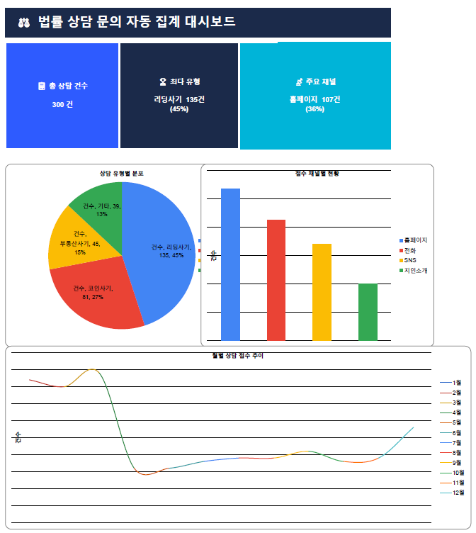
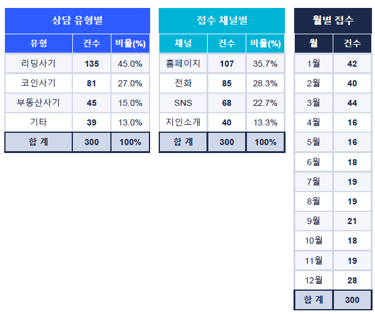

# ⚖ 법률 상담 문의 자동 집계 & 분류 시스템

> Google Apps Script 기반 상담 접수 자동화 프로젝트  
> 법무법인 재직 경험을 바탕으로 실무 문제를 직접 자동화로 해결

---

## 📌 프로젝트 배경

법무법인 재직 당시, 수십 건의 상담 문의를
메일과 전화 등 다양한 채널에서 수신했습니다.

문제는 이 문의들이 별도 시스템 없이 담당자가 직접 엑셀에
수작업으로 옮기고, 유형별로 분류·집계하는 방식으로 처리되고 있었다는 점입니다.
이 과정에서 누락, 중복, 분류 오류가 발생했고
월말 보고용 집계에만 1~2시간이 소요되는 비효율이 반복됐습니다.

"이 흐름을 자동화하면 담당자가 실제 상담 업무에 집중할 수 있겠다"는
문제의식에서 본 프로젝트를 시작했습니다.

Google Forms로 접수 창구를 단일화하고,
Apps Script 트리거로 제출 즉시 유형·채널·월별 집계가
자동으로 반영되는 파이프라인을 구축했습니다.

---

## 🛠 사용 기술

| 도구 | 용도 |
|------|------|
| Google Apps Script | 자동화 핵심 로직 |
| Google Forms | 상담 접수 입력 |
| Google Sheets | 데이터 저장 및 집계 |
| clasp (CLI) | VSCode ↔ 구글 서버 배포 |
| Excel (openpyxl) | 대시보드 시각화 |

---

## ⚙ 시스템 구조
```
상담 접수 (Google Form)
        ↓  onFormSubmit 트리거
Apps Script 자동 실행
        ↓
유형별 / 채널별 / 월별 자동 집계
        ↓
Google Sheets 대시보드 실시간 반영
```

---

## 📊 핵심 기능

### 1. 상담 유형 자동 분류
- 리딩사기 / 코인사기 / 부동산사기 / 기타 4개 유형 자동 집계

### 2. 접수 채널 분석
- 홈페이지 / 전화 / SNS / 지인소개별 유입 경로 추적

### 3. 월별 추이 모니터링
- 월별 접수 건수 자동 집계 → 트렌드 파악

### 4. 성능 최적화
- 초기 구현: 건당 3회 시트 접근 → 300건 기준 900회 API 호출
- 개선 후: 메모리 내 집계 후 **3회 일괄 쓰기**로 처리 속도 대폭 향상

---

## 💡 데이터 인사이트 (300건 분석)

**① 리딩사기 45%, 단일 유형 압도적 1위**
135건으로 2위 코인사기(81건)보다 1.7배 많음.
홍보 콘텐츠를 리딩사기 피해 예방에 집중 시 유입 효율 극대화 가능.

**② 온라인 채널이 전체 58% 차지**
홈페이지(107건) + SNS(68건) = 175건으로 오프라인(125건) 초과.
디지털 마케팅 강화가 상담 접수 증대에 유효함을 시사.

**③ 3월 피크, 4월·5월 급감 — 계절성 패턴 발견**
3월 44건(연중 최고) → 4월·5월 각 16건(연중 최저).
분기 초 사기 피해 신고 집중 패턴으로 해석,
3월 전후 홍보 강화 전략 수립에 활용 가능.

---

## 📁 파일 구조
```
legal-consultation-automation/
├── README.md                        # 프로젝트 설명
├── screenshots/
│   ├── dashboard.png                # 대시보드 스크린샷
│   └── sheet.png                    # 집계 시트 스크린샷
└── data/
    ├── Code.gs                      # Apps Script 메인 코드
    ├── appsscript.json              # 프로젝트 설정
    └── 법률상담자동집계.xlsx        # 대시보드 엑셀 파일
```

---
## 📥 파일 다운로드

| 파일 | 설명 |
|------|------|
| [📊 대시보드 엑셀](data/법률상담자동집계.xlsx) | 집계 시트 + 대시보드 차트 포함 |

---

## 🚀 실행 방법
```bash
# 1. clasp 설치
npm install -g @google/clasp

# 2. 구글 로그인
clasp login

# 3. 프로젝트 연결 후 배포
clasp push

# 4. Apps Script 편집기에서 실행
# setupSheets() → createForm() → 트리거 등록(onFormSubmit)
```

---

## 📈 스크린샷



### 집계 시트



---

## 🙋 개발자

- **이름**: 조승아
- **배경**: 법무법인 약 2년 경력 + 통계데이터과학과 재학
